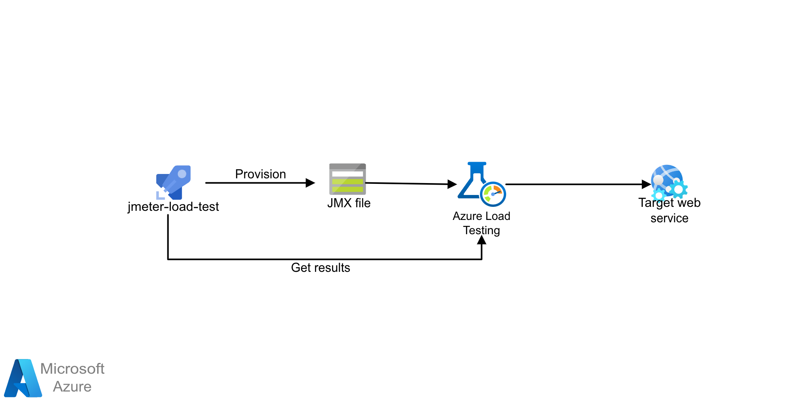

This article covers the patterns and implementations the commercial software engineer (CSE) team used when they created the [Banking system cloud transformation on Azure](banking-system-cloud-transformation.yml).

## Architecture

### Saga architecture

*Download a [Visio file](https://arch-center.azureedge.net/orchestration-based-saga-serverless-arch.vsdx) of this architecture.*

#### Dataflow

Contoso Bank had an on-premises implementation of an orchestration-based saga. In their implementation, the orchestrator is a finite state machine (FSM). The CSE team identified the following challenges in the architecture design:

* Implementation overhead and complexity on the stateful orchestrator to handle with states management, timeouts, and restarts in failure scenarios.

* Observability mechanisms for tracking the saga workflow states per transaction request.

The proposed solution below is a saga pattern implementation through an orchestration approach using a serverless architecture on Azure. It addresses the challenges by using:

* [Azure Functions](https://azure.microsoft.com/services/functions) for the implementation of saga participants.

* [Azure Durable Functions](/azure/azure-functions/durable/durable-functions-overview) for orchestration, designed to provide the workflow programming model and state management.

* [Azure Event Hubs](https://azure.microsoft.com/services/event-hubs) as the data streaming platform.

* [Azure Cosmos DB](https://azure.microsoft.com/services/cosmos-db) as the database service to store data models.

For more information, see [Pattern: Saga](https://microservices.io/patterns/data/saga.html) on Microservices.io.

#### Saga pattern

[Saga](../../reference-architectures/saga/saga.yml) is a pattern suitable for distributed transaction management, commonly applied to financial services. A new scenario has emerged where operations are distributed across applications and databases. In the new scenario, customers will need a new architecture and implementation design to ensure data consistency on financial transactions.

The traditional *atomicity, consistency, isolation, and durability (ACID)* properties approach is no longer suitable. It's because the data of operations are now spanned into isolated databases. Using a saga pattern addresses this challenge by coordinating a workflow through a message-driven sequence of local transactions to ensure data consistency.

### KEDA architecture

*Download a [Visio file](https://arch-center.azureedge.net/eft-processor-autoscaling-keda-kafka-trigger.vsdx) of this architecture.*

For more information on KEDA scalers, see the following KEDA documents:

* [Azure Event Hubs Trigger](https://keda.sh/docs/1.5/scalers/azure-event-hub/): Compatibility for reading Azure blob storage URI for Java applications. It uses the [Event Processor Host](/azure/event-hubs/event-hubs-event-processor-host) SDK, allowing the ability to scale Java consumers that read advanced message queuing protocols (AMQP) protocol messages from Event Hubs. Earlier the Event Hubs scaler worked only with Azure Functions.

* [Apache Kafka topic trigger](https://keda.sh/docs/1.5/scalers/apache-kafka): Support for SASL_SSL Plain authentication, allowing the ability to scale Java consumers that read Kafka protocol messages from Event Hubs.

#### Workflow

1. The CSE team deployed the application on the [Azure Kubernetes Service (AKS)](https://azure.microsoft.com/services/kubernetes-service/) cluster. The solution needed to scale out the application automatically based on the incoming message count. The CSE team used a Kafka scaler to detect if the solution should activate or deactivate application deployment. The Kafka scaler also feeds custom metrics for a specific event source. The event source in this example is an Azure event hub.

1. When the number of messages in the Azure event hub exceeds a threshold, KEDA triggers the pods to scale out, increasing the number of messages processed by the application. Automatic scale down of the pods occurs when the number of messages in the event source falls below the threshold value.

1. The CSE team used the Apache Kafka topic trigger. It gives the solution the ability to scale the EFT Processor service if the process exceeded the maximum number of messages consumed under an interval.

#### KEDA with Java support

[Kubernetes Event-driven Autoscaler (KEDA)](https://keda.sh) determines how the solution should scale any container within Kubernetes. The decision is based on the number of events that it needs to process. KEDA, which has different kinds of scalers, supports multiple types of workloads, supports Azure Functions, and is vendor-agnostic. Go to [Autoscaling Java applications with KEDA using Azure Event Hubs](https://github.com/Azure-Samples/keda-eventhub-kafka-scaler-terraform.git) to explore a working sample.

### Load testing architecture

*Download a [Visio file](https://arch-center.azureedge.net/load-testing-pipeline.vsdx) of this architecture.*

The solution uses Azure Load Testing with JMeter (JMX) scripts. Azure Load Testing is a fully managed load-testing service that enables you to generate high-scale load. The service simulates traffic for your applications, regardless of where they're hosted and can utilize existing JMeter scripts.  

#### Workflow

Azure Load Testing allows you to manually create load tests using the Azure portal or Azure CLI. Alternatively, you can configure a CI/CD pipeline to integrate with Azure Load Testing. Doing so allows you to automate a load test to continuously validate your application performance and stability as part of your CI/CD workflow.

1. Understand how Azure Load Testing works by [creating and running a load test](/azure/load-testing/quickstart-create-and-run-load-test).
1. Use new or existing JMeter scripts and [configure your CI/CD workflow for running load tests](/azure/load-testing/how-to-configure-load-test-cicd).

## Scenario details

This scenario helps you better understand big-picture patterns and implementations in the banking industry, when moving to the cloud.

## Next steps

Learn more about the component technologies:

* [Introduction to Azure Functions](/azure/azure-functions/functions-overview)
* [What are Durable Functions?](/azure/azure-functions/durable/durable-functions-overview)
* [Azure Event Hubs — A big data streaming platform and event ingestion service](/azure/event-hubs/event-hubs-about)
* [Welcome to Azure Cosmos DB](/azure/cosmos-db/introduction)

## Related resources

Explore related architectures:

* [Saga distributed transactions](../../reference-architectures/saga/saga.yml)
* [Gridwich saga orchestration](../../reference-architectures/media-services/gridwich-saga-orchestration.yml)
