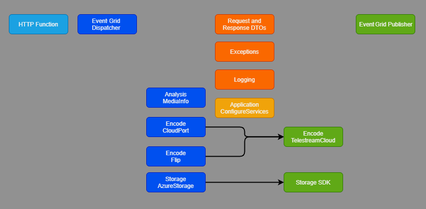

The code in this project is organized as a clean-architecture [monolith](/dotnet/architecture/containerized-lifecycle/design-develop-containerized-apps/monolithic-applications), with the following typical conceptual components:

- API adapters
- Decoupled application business logic
- Core domain objects
- Infrastructure gateways
- Inversion of Control (IoC)

The solution is stateless, so it doesn't contain any gateways to persistence layers. The solution has no user interface, so it has no controllers or presenters.

The software component composition uses the [GridwichConfigureServices](https://github.com/mspnp/gridwich/blob/main/src/Gridwich.Host.FunctionApp/src/GridwichConfigureServices.cs) class to define which concrete classes are available in the IoC container for the Azure Functions App.

## Architecture

The Gridwich solution has a [Core.EventGrid](https://github.com/mspnp/gridwich/tree/main/src/Gridwich.Core.EventGrid/) library, which contains:

- The domain request and response data transfer objects (DTOs).
- Interfaces for all application business logic or service objects.
- The base classes that help achieve common domain-driven logic or activities.
- Logging, observability, and exception definitions for use throughout the application.

To encapsulate Azure Event Grid as a request and response broker, the library has:

- An event dispatcher that uses the IoC to identify and dispatch events to listeners.
- An event publisher to place responses on the correct Event Grid topic.

The Event Grid request adapter is an HTTP endpoint in the form of an [Azure Function HTTP Endpoint](/azure/azure-functions/functions-bindings-http-webhook). An adapter to convert web requests to Event Grid arrays is also in the same [EventGridFunction](https://github.com/mspnp/gridwich/blob/main/src/Gridwich.Host.FunctionApp/src/Functions/EventGridFunction.cs).

The Event Grid response gateway consists of:

- The [EventGridHandlerBase](https://github.com/mspnp/gridwich/blob/main/src/Gridwich.Core/src/Bases/EventGridHandlerBase.cs), which converts a response DTO into an `EventGridEvent` object.
- The [EventGridDispatcher](https://github.com/mspnp/gridwich/blob/main/src/Gridwich.Core.EventGrid/src/EventGridDispatcher.cs), which places the Event Grid event on the correct response Event Grid topic endpoint URI by using the topic key.

The solution decouples the [saga participants](gridwich-saga-orchestration.yml#saga-participants) into the following libraries, which have responsibilities over domain-specific application business logic. The libraries contain required infrastructure gateways and their SDKs, which accomplish the actions that the business logic requires.

- [Gridwich.SagaParticipants.Analysis.MediaInfo](https://github.com/mspnp/gridwich/blob/main/src/Gridwich.SagaParticipants.Analysis.MediaInfo/)
- [Gridwich.SagaParticipants.Encode.CloudPort](https://github.com/mspnp/gridwich/blob/main/src/Gridwich.SagaParticipants.Encode.CloudPort/)
- [Gridwich.SagaParticipants.Encode.Flip](https://github.com/mspnp/gridwich/blob/main/src/Gridwich.SagaParticipants.Encode.Flip/)
- [Gridwich.SagaParticipants.Storage.AzureStorage](https://github.com/mspnp/gridwich/blob/main/src/Gridwich.SagaParticipants.Storage.AzureStorage/)

For code reuse and centralization, Gridwich consolidates business logic or infrastructure gateways that several participants use into the following shared libraries:

- [Gridwich.SagaParticipants.Encode](https://github.com/mspnp/gridwich/blob/main/src/Gridwich.SagaParticipants.Encode/)
- [Gridwich.SagaParticipants.Encode.TelestreamCloud](https://github.com/mspnp/gridwich/blob/main/src/Gridwich.SagaParticipants.Encode.TelestreamCloud/)

## Microservices alternative

Nothing in the Gridwich problem space or architecture explicitly pushes the solution into either a monolithic app or several microservices.

You could easily refactor the app into microservices, each a Function App hosting a single saga participant. Each Function app would link the core and core Event Grid libraries.  The apps would each have a linkage or use a common library for infrastructure gateways.

The advantage of such a microservices approach is the ability to scale differently for each type of request. If there were thousands of one request type per second, but only hundreds of another request type per day, the overall solution would benefit from having smaller, easy-to-instantiate, and quick-to-execute functions for the high-volume requests.

The drawback of microservices is that any shared models require synchronized rollout of the microservices, or request pool draining and switchover if there's a data schema change. This requirement would complicate future development, continuous deployment, and operations. Since the business problem didn't demonstrate a need for microservices, Gridwich architecture uses a clean monolith approach.

## Next steps

- [What are microservices?](/devops/deliver/what-are-microservices): Explore microservice architecture.
- [Introduction to Azure Functions](/azure/azure-functions/functions-overview): Learn more about Azure Functions.

## Related resources

- [Understand Gridwich cloud media system](gridwich-architecture.yml)
- [Explore Gridwich project naming](gridwich-project-names.yml)
- [Set up Gridwich CI/CD pipeline](gridwich-cicd.yml)
